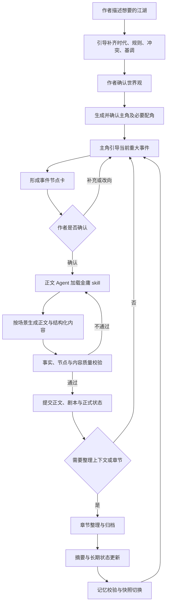

# 漫想 · 江湖写作陪伴助手 PRD

| 项目 | 说明 |
| --- | --- |
| 版本 | v0.2 · 基于作者反馈修订 |
| 产品定位 | 主角陪作者构思重大事件，正文 Agent 调用金庸 skill，把已确认的节点写成江湖小说 |
| 用户身份 | 作者，拥有设定、故事走向与作品解释的最终决定权 |
| 首版交付 | 单人中文网页工作台；世界观引导、主角互动、节点创作、小说正文、章节记忆及结构化导出 |
| 文档依据 | 本轮用户回答、既有 PRD，以及本项目 Agent Loop、Skill Loading、Memory、Context Compact、Workflow Runtime 文档 |
| 实现状态 | 本规格已有可运行首版；根路径为小说工作台，原漫画功能位于 /comic。实现范围与尚未完成项见[开发交付说明](开发交付.md)，不代表全部 P0 均已验收 |
| 版本关系 | 本文替代写作陪伴助手 v0.1 的产品定义；旧稿保存在 history/ 中 |

## 1. 产品定义与本轮决策

### 1.1 核心体验

作者先在助手引导下描述江湖世界，确认时代背景、世界规则、核心冲突和故事基调。系统据此生成主角。主角以自己的性格、处境和动机向作者提问，帮助作者完善眼前的重大事件。

作者明确节点中的主要人物、动机、关键选择、结果和代价后，确认本次事件方案。正文 Agent 加载 `jin-yong-perspective`，将节点内及连接节点所需的经历写成有实际推进的小说正文。章节与摘要 Agent 持续整理作品，保存角色设定、关键事实、未解决伏笔及正在讨论的节点。

**核心闭环：引导世界观 → 确认主角 → 主角追问当前重大事件 → 作者确认节点 → skill 扩写正文 → 写入作品 → 章节与记忆整理 → 引导下一个事件。**

### 1.2 已确认决策与解释边界

| 议题 | 用户反馈 | 本版规则 |
| --- | --- | --- |
| 用户身份 | 用户是作者，主角引导完成故事线 | 作者不自动成为小说中的人物；创作对话与小说对白分开保存 |
| 世界观最低要求 | 采纳时代、规则、冲突、基调的建议 | 四项核心信息确认后再生成主角 |
| 主角权限 | 可以反问、追问，最终决定权在用户 | 主角可表达性格冲突及代价，不能永久否决作者决定 |
| 故事线规划 | 不需要提前看整条故事线，解释权在用户 | 增量生成当前节点；未来建议不锁定走向，不强制回到预设主线 |
| 节点确认 | 采纳关键内容确认后扩写的建议 | 确认事件的动机、选择、结果与代价，再交给正文 Agent |
| 正文质量 | 至少有主要内容，不要水剧情 | 用事件覆盖和有效变化验收，不用最低字数代替质量 |
| 扩写自由度 | 可以增加中间内容 | 可增加配角、支线、关系细节与伏笔，遵守作者确认结果和设定 |
| 冲突与修改 | 对先前规则回答“是的” | 已确认设定及节点优先，支持局部重写；改变重大事件另建修订版本 |
| 题材 | 江湖 | 首版面向武侠江湖，允许历史背景或架空世界 |
| 人物道德 | “突破道德底线” | 暂按允许人物背叛、欺骗、复仇和道德堕落理解，不强制主角成为正面英雄；具体描写尺度及禁区由作者偏好补充 |

最后一项是对简短回答的工作解释，不等于作者授权所有具体情节。产品不预设主角必然行善，也不将人物越界解释为可以覆盖作者的明确禁区。

### 1.3 成功标准

1. 作者能在少量有针对性的问答中建立可写作的世界观。
2. 主角具有稳定性格与动机，能提出有助于完善重大事件的问题。
3. 作者不必先规划全书，能够连续完成多个事件节点。
4. 节点确认后生成实质内容；中间描写服务事件、人物变化或伏笔。
5. 作者的决定不被主角、技能规则或系统自拟大纲无声覆盖。
6. 随时可导出小说正文及其结构化剧本，包括未归档的正式内容。
7. 压缩后，人物设定、有效关键事实、未解伏笔和当前未完成节点完整保留。

## 2. 用户场景与首版范围

| 场景 | 示例 | 预期结果 |
| --- | --- | --- |
| 只有模糊灵感 | “我要一个门派衰败、少年复仇的江湖” | 助手追问规则、矛盾与基调，形成可修改世界草案 |
| 主角性格尚不清晰 | “他表面重义气，但很怕失去地位” | 生成有矛盾、有弱点的主角卡供确认 |
| 当前事件缺少动机 | “让他背叛师门” | 主角追问背叛原因、付出代价及作者期望的结果 |
| 作者已给出完整事件 | “他为救妹妹交出名册，被师门逐出，暂不暴露妹妹身份” | 直接整理节点卡供确认，不重复问已有答案 |
| 作者改变故事方向 | “这次不拜师了，去投靠仇家” | 放弃旧建议，检查与现有事实的关系，建立新节点 |
| 正文过于拖沓 | “删掉重复回忆，保留试探与交出名册的冲突” | 局部重写，不改变已确认结果 |
| 长篇继续写作 | “接着上一章未完的谈判” | 恢复当前节点、待决问题、人物位置与伏笔 |

### 2.1 P0 能力

- 江湖世界观引导及明确确认。
- 主角生成、修改、确认与主要配角管理。
- 主角以角色口吻引导作者构建重大事件。
- 当前事件卡、缺项识别、确认、改向与修订。
- 金庸 skill 版本化接入，按节点分场景生成小说正文。
- 正文与结构化剧本同步写入、来源映射及局部重写。
- 章节整理、记忆更新、压缩前后完整性检查。
- 保存续写、Markdown / JSON 导出、异常恢复。

### 2.2 P1 能力

- 全书总览与多条候选路线对比，由作者主动打开。
- 多分支历史、复杂跨章批量改写、版本对照合并。
- 跨设备账号、DOCX / PDF 导出、语音和插画。

首版采用一个故事一条正式时间线。基本的重大事件修订属于 P0：检查依赖、标记受影响内容、逐段更新并保留旧版本；同时维护多条正式分支属于 P1。

## 3. 交互与生成流程

每轮主角对话优先只提出 1～2 个关键问题。作者明确要求更多建议时再展开；信息充足时直接给出节点确认卡，不以固定问答轮数作为完成条件。

### 3.1 三种对话与正文边界

| 内容 | 用途 | 是否属于小说已发生事实 |
| --- | --- | --- |
| 作者与主角的创作讨论 | 讨论动机、选择、结果与代价 | 否 |
| 已确认事件方案 | 指导即将生成的正文，约束结果 | 尚未发生 |
| 通过校验并提交的正文及事件 | 构成正式故事历史 | 是 |

主角在创作讨论中可以向作者说“若我交出名册，师父是否还会认我？”，这句话不能自动成为小说中对某人的对白。只有作者要求收录或正文明确安排发生，才进入对应场景。

讨论采用“作者知情视角”，可谈秘密和未来方案；小说中的人物仍只知道其在剧情中实际获得的信息。

## 4. 世界观与人物需求

### 4.1 世界观引导（FR-01）

先接受自由描述，再根据缺项提出问题。核心确认项如下：

| 核心项 | 至少明确什么 |
| --- | --- |
| 时代背景 | 真实历史或架空、基本地域、社会与门派环境 |
| 世界规则 | 武学能力上限、权力秩序、重要限制、是否存在超自然元素 |
| 核心冲突 | 主角或江湖面临的主要矛盾、相关势力与利益 |
| 故事基调 | 热血、冷峻、悲剧、诙谐等倾向，作者希望避开的内容 |

- 未决定的细节标注“待定”，助手可以提供建议，不能伪装成作者已经选定。
- 作者可以先写少量必要设定，其他地理、门派和人物在需要时补充。
- 历史题材记录史实与虚构的边界；作者选择架空后，不因 skill 的史实原则强制更改其世界。
- 允许道德灰度、反英雄与人物堕落，不预设必须走向“为国为民”的结局。
- 确认后生成世界版本；后续修改显示影响范围，保留旧版本。

### 4.2 主角与配角生成（FR-02）

主角卡包含：稳定 ID、姓名、身份、外貌与身体特征、性格矛盾、目标、恐惧、重要关系、能力与限制、初始处境、说话方式、已知信息。

- 主角生成必须依据当前已确认世界版本。
- 用户可改名、调整性格与经历，不因字段修改创建另一个人物身份。
- NPC Agent 只生成当前创作需要的主要配角，默认可建议 2～4 人；不要求开局列完所有人物。
- 静态设定和动态状态分别保存。性格成长由正式事件支撑，位置和持有物随正文更新。
- 主角若对作者安排提出质疑，应说明性格、动机或后果上的矛盾，并给出可行补充。
- 作者坚持选择时，系统通过补充动机或建立设定修订解决冲突，不能用反复追问否决作者。

## 5. 主角引导与重大事件节点

### 5.1 主角职责（FR-03）

主角 Agent 负责发现当前事件的缺口，帮助作者形成完整的因果链。它不承担长篇正文扩写，也不代替作者决定结局。

可提出的问题包括：

- 我为什么非做这件事不可？
- 我知道哪些信息，误以为什么？
- 谁会阻止我，他为什么这样做？
- 如果成功，我会失去什么？
- 这次事件之后，我与谁的关系会改变？

主角只在重大事件构思、关键缺项、重大冲突或作者主动交流时介入。旅途、饭局、动作衔接等中间内容由正文 Agent 扩写，不要求作者逐句推动。

### 5.2 当前节点卡（FR-04）

| 字段 | 要求 |
| --- | --- |
| 节点 ID、标题与版本 | 稳定标识及修改记录 |
| 事件起点 | 当前时空、在场人物、相关既有事实 |
| 主要内容 | 这次真正要发生的事，不能只有情绪或环境 |
| 参与人物与动机 | 谁要什么、谁阻碍什么 |
| 触发原因 | 事件为什么此时发生 |
| 关键选择 | 作者决定主角如何行动 |
| 预期结果与代价 | 事情如何结束，人物和局面发生哪些变化 |
| 必须保留 | 指定台词、关系变化、场景、伏笔等 |
| 不能改变 / 暂不揭示 | 不能越过的作者约束、尚不揭开的秘密 |
| 可自由扩写范围 | 配角、支线、动作、情绪、线索等授权 |
| 完成条件 | 正文覆盖哪些事实才算写完 |
| 作者确认记录 | 确认的明确版本及其依赖设定 |

节点可以不写出最终全书影响，但当前事件的主要结果与代价必须足够清楚。无法确认的关键结局应保留为待决问题，而不是交给正文 Agent 擅自决定。

### 5.3 完成条件（FR-05）

节点有两种不同的完成状态：

1. **可扩写：**必要信息齐全，作者确认有效版本。
2. **已完成：**正文已经覆盖主要事件、选择、结果和代价，通过校验并提交。

节点状态建议：

> 构思中 → 待确认 → 已确认 → 扩写中 → 校验中 → 已完成。

补充状态：待作者补充、扩写失败、已改向、受修订影响。系统不能将“作者确认方案”直接计为“故事已经发生”。

### 5.4 故事线的开放性（FR-06）

- 默认只呈现当前节点，以及作者需要时的少量下一步建议。
- 系统可以维护伏笔和候选方向，但未确认的未来方案不构成事实或强制约束。
- 作者拒绝拜师、改投仇家或提前结束支线时，可以重新构造后续路线。
- 主角可解释改变方向可能带来的后果，最终采纳哪种解释由作者决定。
- 作者改变已发生的重大事件时，走显式修订流程；不能通过普通下一轮输入让旧事实悄悄消失。

## 6. 金庸 skill 与正文生成

### 6.1 接入职责（FR-07）

指定来源：[Wunicheng233/jin-yong-perspective](https://github.com/Wunicheng233/jin-yong-perspective)。其说明涉及人物成长、复杂情节、伏笔、武侠叙事与表达，也含以金庸身份回应的规则。[SKILL.md](https://github.com/Wunicheng233/jin-yong-perspective/blob/main/SKILL.md)

产品将它作为正文 Agent 的创作指导。主角陪伴对话继续使用已确认的主角身份；交付正文是原创江湖小说，不混入技能的顾问式自我介绍。

接入必须记录上游仓库、实际选定的 commit、文件内容校验值与产品适配版本。固定版本后使用，不能每次写作时无提示切换到最新内容。本 PRD 不声称技能已经安装或接入。

适配原则：

- 加载技能的创作方法，并明确本次任务是输出小说正文与结构化结果。
- 原始 skill 单独保留，产品身份与输出约束由宿主提供；不静默改写上游文件。
- 世界观、人物和事件卡中的作者确认内容优先；技能的典型成长路径、历史框架和价值倾向不能覆盖作者选择。
- 技能不可读取或解析失败时停止正文任务，保留节点并提供重试，不能假装已调用后换普通生成。
- 文风合适不代表节点完成，输出仍需接受事件与状态校验。

### 6.2 正文输入合同（FR-08）

正文 Agent 接收：

- 正式世界与角色版本；相关人物的完整卡片。
- 当前节点的作者确认版本、结果、代价和自由扩写范围。
- 当前时空与动态状态、上一章摘要。
- 相关关键事实、承诺与未解决伏笔。
- 本节点已提交的正文片段和待完成条件。
- 作者的文风、节奏、避开项和必须保留的台词。
- 本次选定的 skill 版本。

主角聊天中未确认的设想应被明确排除，或以“未采用候选”标记，不能当成既有事实输入。

### 6.3 输出及提交（FR-09）

输出包括：小说正文、场景结构、动作与对白映射、事件、状态变化提案、新增人物 / 事实 / 伏笔条目、节点完成情况及来源引用。

- 一次任务可分多个有意义的场景顺序生成，前一段结果进入下一段上下文。
- 不要求把整部小说塞进一次调用；“整个故事”由连续节点与章节构成。
- 中间自动增加的配角与伏笔在正文提交后进入正式记录，不能只停留在文本里。
- 正文、结构化剧本、事件与动态状态一致提交，避免后续人物状态落后于正文。
- 技术分段失败后保留已提交片段，节点维持未完成；续写只补齐未完成条件，不重复开场。

### 6.4 不水剧情的验收口径（FR-10）

用户未指定字数，本版不设“达到多少字就算完成”。每个场景至少承担一项明确作用：推动主要事件、改变人物关系、揭示有效信息、体现会影响选择的人物变化，或埋设 / 推进 / 回收伏笔。

检查规则：

1. 节点要求的主要内容、关键选择、结果与代价必须实际出现。
2. 对同一背景或情绪的重复复述不能代替事件推进。
3. 过渡描写要为随后行动提供时间、地点、动机或气氛上的必要衔接。
4. 允许舒缓场景，但须具有信息、关系或人物塑造上的作用。
5. 每个场景有简短的内部作用标记与节点关联，供校验使用，不必显示给读者。
6. 作者可要求精简、加强冲突或保留细节；字数只作为软偏好。

结构规则可自动检查；“是否拖沓”仍需要固定样例评测及作者反馈，不宣称模型自评能完全保证文学质量。

### 6.5 扩写边界（FR-11）

可自主补充：符合场景的配角、合理旅途和动作衔接、人物试探、支线线索、关系细节、尚未改变节点结局的伏笔。

需要回到作者确认的情况：

- 改变已确认的主要事件结果或关键代价。
- 让重要角色死亡、永久失能，或不可逆地改变其核心关系，而节点中没有相关授权。
- 把作者要求暂不揭示的秘密提前揭开。
- 改变基础世界规则或已确认人物身份。
- 把临时配角提升为改变当前主线结果的关键力量。

人物可以越界、背叛、作恶；这些情节是否发生仍依据作者设定和节点授权，不因为“需要冲突”自动添加。

## 7. 版本、重写与作者控制权

### 7.1 局部重写（FR-12）

作者可选择正文片段并说明“更紧凑”“减少旁白”“增强试探”等要求。生成前锁定节点结果及不能改变的事实，形成候选新版本；作者接受后替换当前有效正文，并保留旧版本。

如果候选改变了关键事件或事实，系统不得按普通润色直接提交，应显示差异并转入重大修订。

### 7.2 重大修订（FR-13）

1. 作者明确修改世界、主角或已经发生的重大事件。
2. 系统列出受影响的节点、正文、人物状态、伏笔和摘要。
3. 作者确认修订范围，创建新版本；旧版本保持可查看。
4. 依次更新受影响内容，未完成部分标记“待同步”。
5. 校验完成后切换正式时间线及记忆快照。

修订未完成时暂停依赖旧结果的新节点扩写。首版允许按依赖顺序逐项恢复；不要求一次自动重写整部长篇，也不向作者隐藏未同步部分。

## 8. Agent 分工与本地文档映射

### 8.1 职责划分

| 组件 | 主要任务 | 正式输出边界 |
| --- | --- | --- |
| 世界观 Agent | 引导四项核心设定、生成世界草案 | 作者确认后形成正式世界版本 |
| 人物 / NPC Agent | 生成主角和必要配角，发现依赖冲突 | 不自行改写已确认世界 |
| 主角引导 Agent | 用主角口吻追问重大事件，整理节点卡 | 不直接写长篇正文，不提交剧情事实 |
| 正文 Agent + 金庸 skill | 扩写确认节点，生成场景与故事增量 | 只提交候选正文与结构化变更 |
| 章节 Agent | 组织已有正文，分章分节、归档与来源映射 | 不新增未发生事件，不改变结局 |
| 摘要 Agent | 更新前情、长期状态、未解伏笔和当前节点记忆 | 不擅自重写人物卡或删除关键事实 |
| 宿主工作流 | 版本检查、任务调度、校验、保存与恢复 | 负责正式状态切换，不由模型自定 |

这是产品职责划分，不要求每个组件使用不同模型，也不要求全部并行运行。

### 8.2 依托现有文档的设计依据

以下路径相对本 PRD 所在目录，可在当前工作区打开。学习仓库中的实现是参考机制，仍需适配网页应用的身份、存储和运行环境。

| 本地文档 | 已有机制 | 本产品的应用 |
| --- | --- | --- |
| [s01 Agent Loop](../../s01_agent_loop/README.zh.md) | 模型调用工具、读取结果后继续循环 | 主角获取设定和节点信息后决定下一次追问 |
| [s06 Subagent](../../s06_subagent/README.zh.md) | 子任务独立消息上下文，返回有界结果 | 主角讨论、正文、章节、摘要分别准备输入，减少身份串扰 |
| [s07 Skill Loading](../../s07_skill_loading/README.zh.md) | 技能目录常驻，正文按需加载 | 进入扩写阶段再加载金庸 skill，不在所有讨论轮次注入全文 |
| [s08 Context Compact](../../s08_context_compact/README.zh.md) | 先处理可恢复内容，再摘要历史 | 长正文保存原文与索引，必要时召回；最后才压缩讨论 |
| [s09 Memory](../../s09_memory/README.zh.md) | 持久存储、索引、相关性选择、按需召回 | 人物、事实、伏笔独立保存，按节点涉及实体检索 |
| [s16 Workflow Runtime](../../s16_workflow_runtime/README.zh.md) | 可信编排、结构化输出、journal 与续跑 | 扩写、校验、归档、摘要分阶段执行，失败从原检查点恢复 |

产品中不能直接让模型输出任意可执行工作流；使用宿主管理的既定流程与受校验参数。参考 s06 的上下文隔离不等于文件权限隔离，正式状态写入仍由宿主统一管理。

s16 的示例 journal 是任务恢复依据，不自动等同于业务事务数据库。正文和事实的原子提交、存档归属等业务能力仍需在应用中实现。

### 8.3 工作流与检查点

| 工作流 | 顺序与检查点 |
| --- | --- |
| 开局 | 收集世界 → 世界确认 → 生成人物 → 人物确认 |
| 节点扩写 | 节点版本锁定 → 记忆召回 → 加载 skill → 场景生成 → 校验 → 提交 |
| 章节整理 | 来源范围锁定 → 章节组织 → 归档 → 摘要更新 → 记忆校验 → 切换快照 |
| 修订 | 影响分析 → 作者确认 → 按依赖更新 → 校验 → 切换有效版本 |

任务记录 `story_id`、`node_id`、输入版本、skill 版本、运行 ID、阶段、来源范围与结果。相同运行的恢复复用已成功且依赖未变化的阶段；重跑后不能重复扣除物品或再次归档同一范围。

## 9. 章节、压缩与长期记忆

### 9.1 章节整理（FR-14）

- 正文 Agent 负责写作；章节 Agent 负责组织已经写好的内容，不再将整段正文重新自由创作一遍。
- 优先在已完成事件或自然场景边界形成章节。
- 达到上下文阈值时可以先归档章节中的一个小节；不强行写出本章结局。
- 章节记录节点、场景与来源片段范围，已归档内容不能再次出现在当前草稿区。
- 若节点尚在讨论、没有新增正文，只整理创作对话与节点记忆，不凭空生成一章小说。

### 9.2 上下文预算（FR-15）

模型输入预算为总容量减去输出预留和安全余量。分别计算主角引导、正文、章节和摘要任务的输入预算，不要求所有 Agent 共用一份完整聊天历史。

建议默认：输入占可用预算达到 70% 后安排整理；新任务开始前若达到 85%，先完成必要整理。具体数值待模型及真实故事评测确定。

处理顺序：

1. 将完整正文、旧任务输出保存到持久存储，提示词保留索引和必要片段。
2. 去掉重复资料和当前节点无关的历史原文。
3. 从人物、事实和伏笔索引召回相关记录。
4. 仍不足时生成章节摘要或创作讨论摘要。
5. 检查新快照是否保留必需内容，并重新计算预算。

超长输入或核心设定本身超过预算时应明确提示，不能静默截断。整理期间可编辑作者草稿、回顾和导出；依赖新快照的生成等待其完成。

### 9.3 长期记忆合同（FR-16）

| 类型 | 保留内容 | 权威来源 |
| --- | --- | --- |
| 世界与主角设定 | 有效版本、规则、性格、能力限制、作者禁区 | 作者确认记录 |
| 已发生关键事实 | 谁做了什么、物品归属、身份变化及有效状态 | 正式正文事件与来源 |
| 人物关系与知识 | 承诺、敌友变化、谁知道什么 | 已发生事件 |
| 未解决伏笔 | 稳定 ID、内容、首次出现、进展、相关实体 | 正式埋设与推进记录 |
| 当前节点工作记忆 | 已确认项、待决问题、自由扩写范围、完成条件 | 作者讨论及节点版本 |
| 上一章摘要 | 关键经过、变化和章末位置 | 已归档来源范围 |
| 未采用建议 | 作者拒绝或放弃的方向 | 创作讨论；与正式事实分开 |

“新章节摘要”只负责压缩表达。角色卡、关键事实与伏笔独立保存，摘要 Agent 不得把它们的省略理解为删除。

### 9.4 压缩校验与切换（FR-17）

- 比较新旧快照：所有有效人物设定、关键事实和未解决伏笔均应保留或有明确修订依据。
- 伏笔只有在正式正文中解决、或作者明确废弃时才离开未解决集合。
- 区分已知事实、人物猜测、计划和作者未确认建议。
- 保留当前节点的待决问题；压缩后主角不能反复询问已确认答案。
- 保留谁在场、在哪里、何时、正在处理什么，保证正文衔接。
- 章节已归档但摘要失败时，恢复摘要阶段，旧可用快照继续保存。
- 新快照校验通过前不切换。压缩只改变信息装入方式，不再次应用剧情事件。

## 10. 保存、正文和导出

### 10.1 内容分层（FR-18）

作品同时保存：作者讨论、世界与人物版本、节点方案、小说正文、结构化剧本、正式事件、章节归档和记忆快照。

小说正文是主要阅读产物。结构化剧本按场景、动作、对白和旁白组织，保留与正文片段的来源映射。两者不能作为独立创作各自改写事实；更新正文时同步更新其结构化表示。

### 10.2 随时导出（FR-19）

P0 格式：

- **Markdown：**故事信息、世界与主角、小说章节、当前正式草稿；可选附录包含结构化剧本与作者讨论。
- **JSON：**全部上述对象及 ID、版本、来源映射、事实、伏笔、节点状态和记忆覆盖范围。

导出规则：

1. 创建期可导出设定草案，并明确“未确认”。
2. 节点讨论可导出事件方案，但不能混入“已发生剧情”。
3. 生成中只导出最后已提交的内容，注明节点尚未完成。
4. 整理中允许导出已归档章节与活动正文，记忆注明其真实覆盖范围。
5. 以一致快照读取，不因并发写入造成丢段或重复。
6. 重大修订未完成时默认导出上一完整有效版本，可另导出带状态标记的修订草案。
7. 未归档正式正文必须包含；来源回合已归档后不能再次导出为草稿。

### 10.3 保存与恢复（FR-20）

首版默认服务端保存作品，当前浏览器持有匿名访问凭证。故事列表可继续最近工作阶段，清除浏览器数据可能失去匿名访问入口；账号与跨设备同步属于后续能力。

同一故事一次只提交一个写作事务。重复请求返回相同任务结果；旧状态版本在其他标签页提交时提示冲突。客户端断线先查询原任务，不直接重跑。

## 11. 页面与异常处理

### 11.1 主要页面

| 页面 | 必要内容 |
| --- | --- |
| 我的江湖 | 新建故事、最近章节、当前节点与恢复入口 |
| 世界观引导 | 自由输入、针对性提问、四项核心摘要与确认 |
| 主角确认 | 人物卡、性格与动机、修改与确认 |
| 写作工作台 | 主角对话、当前节点卡、待确认内容、生成正文入口 |
| 小说与剧本 | 章节阅读、当前草稿、结构化切换、局部重写 |
| 设定与记忆 | 人物、正式事实、未解伏笔、当前待决问题 |
| 导出 | 格式、快照范围、完成状态、下载 |

界面显示“主角正在整理事件”“正在扩写正文”“正在归档章节”等真实任务阶段，不用模型或 Agent 数量作为用户必须理解的概念。

### 11.2 异常策略

| 异常 | 处理 |
| --- | --- |
| 世界观信息不足 | 问缺少的关键项，保留已有答案 |
| 人物性格与作者安排冲突 | 说明矛盾并追问动机；作者决定修订方式 |
| 未确认节点请求扩写 | 展示当前节点卡并要求确认，不生成正式正文 |
| skill 缺失或版本失效 | 保留任务，说明未完成技能加载，允许修复后继续 |
| 正文缺少节点主内容 | 修复候选；仍失败则保留上一完整状态 |
| 中途需要新的重大决定 | 暂停受影响片段，交主角向作者提问 |
| 局部改写改变重大事实 | 升级为明确修订，不按润色提交 |
| 章节完成但摘要失败 | 不重复归档，从摘要阶段恢复 |
| 摘要漏掉关键记忆 | 阻止快照切换并修复 |
| 导出失败 | 不影响原作品，重试同一快照 |

## 12. 验收标准

| 编号 | 场景 | 通过条件 |
| --- | --- | --- |
| AC-01 | 作者只给一句江湖方向 | 完成四项核心设定引导，已有答案不重复追问 |
| AC-02 | 世界观尚未确认 | 不将草案视为正式世界生成可用正文 |
| AC-03 | 生成主角 | 主角匹配已确认世界，角色卡可修改并绑定版本 |
| AC-04 | 作者不在小说中 | 创作讨论不自动形成小说角色、对白或已发生事实 |
| AC-05 | 作者提出违背性格的决定 | 主角可以追问，不越过作者最终决定权 |
| AC-06 | 不提供全书大纲 | 作者仍可建立并连续完成至少 3 个重大事件节点 |
| AC-07 | 作者改变未来方向 | 未确认路线可放弃，不强制回到旧主线 |
| AC-08 | 节点缺少关键结果 | 先澄清和确认，不由扩写任意决定结局 |
| AC-09 | 节点已完整 | 直接给确认卡，不为了流程增加无意义问答 |
| AC-10 | 确认节点后未生成正文 | 已确认计划不改变物品、关系或已发生事件 |
| AC-11 | 正文调用 skill | 可追溯到固定 skill 与适配版本，缺失不伪装成功 |
| AC-12 | 身份边界 | 主角保持确认身份，正文不混入金庸顾问身份的自我介绍 |
| AC-13 | 场景扩写 | 节点主事件、关键选择、结果和代价都有正文依据 |
| AC-14 | 中间内容质量 | 场景具有明确作用，无用重复不靠字数通过验收 |
| AC-15 | 新增配角和伏笔 | 合理补充可记录，改变确认结果的内容先询问作者 |
| AC-16 | 道德灰度人物 | 不强制改写为正面英雄，同时遵守作者明确禁区 |
| AC-17 | 作者局部重写 | 只改变指定表达，事实不一致时转重大修订 |
| AC-18 | 重大事件修订 | 有影响范围、版本和待同步标记，不把旧新事实混用 |
| AC-19 | 讨论超出上下文 | 保留节点与待决问题，不凭空归档为一章小说 |
| AC-20 | 正文跨多个生成片段 | 已提交片段不丢失、不重复，节点仍按完成条件结算 |
| AC-21 | 三次强制整理 | 角色设定、有效关键事实、未解伏笔全部保留或有正式变更依据 |
| AC-22 | 整理后继续引导 | 已确认答案不重复询问，未定结果不被写成既定事实 |
| AC-23 | 整理后继续正文 | 正确衔接时空、人物知识、当前动作及相关伏笔 |
| AC-24 | 摘要任务失败恢复 | 不重复章节和状态变更，只恢复未完成阶段 |
| AC-25 | 随时导出 | 草案、讨论、生成、整理期间均可导出明确范围的一致快照 |
| AC-26 | 导出结构完整 | 小说和剧本来源一致，无正式片段遗漏或重复 |
| AC-27 | 重复和并发提交 | 同请求最多一次业务提交，过期版本得到明确提示 |
| AC-28 | 归档后事实变化 | 新快照记录变化及来源，不机械恢复旧状态 |
| AC-29 | 保存续写 | 刷新后恢复原作品与任务阶段，其他用户无法读取存档 |
| AC-30 | 当前实现说明 | 文档及界面交付状态区分已有漫画能力与待实现小说能力 |

### 12.1 综合测试故事

设定：林澈右手有旧伤，武学水平尚低；妹妹的藏身地尚未被敌人知晓。作者确认节点：林澈为救妹妹交出师门名册，被逐出师门；妹妹所在地暂不揭示。

应出现的完整过程：

1. 主角只追问尚未明确的动机和代价，作者确认后扩写。
2. 讨论“交出名册”时，名册仍属于原持有者。
3. 正文包含试探、冲突、交出名册及逐出师门，过渡服务这些事件。
4. 允许新增送信人或蓝印章伏笔，不允许私自写死妹妹或泄露藏身地。
5. 正文正式提交后，名册归属与师门关系一起更新。
6. 经 3 次整理，旧伤、实际名册归属、妹妹秘密与未解蓝印章线索均保留。
7. 作者决定接下来投靠仇家时，系统允许改向，不强迫走拜师路线。
8. 导出同时包含正式正文、对应剧本和当前待确认节点，明确三者状态。

关键记忆保留与引用完整性在固定测试用例中要求 100%；文学质量用样例及作者反馈评估，不宣称绝对保证。

## 13. 实施里程碑、指标与待定项

### 13.1 里程碑

| 阶段 | 交付 | 门槛 |
| --- | --- | --- |
| M1 | 世界观、主角、节点引导与确认 | 作者可完成一个信息完整的事件卡 |
| M2 | skill 接入、正文生成、剧本、保存与导出 | 连续完成 3 个节点，正文覆盖节点主内容 |
| M3 | 章节、长期记忆、压缩与恢复 | 综合测试及 3 次整理校验通过 |
| M4 | 局部重写、重大修订与试用完善 | 影响关系清楚，P0 验收通过 |

### 13.2 观察指标

- 世界观确认率、主角确认率、节点从构思到确认所需轮次。
- 连续完成 3 个节点的故事占比，及作者主动继续创作的情况。
- 节点主内容覆盖率、作者因“水剧情”要求精简的比例。
- 作者选择被错误覆盖的次数。
- skill 加载成功率、正文与记忆阶段耗时、失败恢复率。
- 关键记忆保留率、结构化导出完整率。

性能建议为提交后 1 秒内出现状态反馈。正文长度变化较大，应分别统计各阶段耗时，再制定完成时延目标；不在缺少模型评测时承诺固定长篇生成时间。

### 13.3 仍需后续确认，但不阻止首版原型

| 问题 | 当前工作默认 |
| --- | --- |
| “突破道德底线”的具体描写尺度 | 允许复杂、黑暗人物与相应情节；世界引导时收集作者明确禁区 |
| 正文采用哪种人称 | 默认第三人称；主角陪伴对话使用角色第一人称 |
| 一次扩写输出多少内容 | 覆盖已确认事件所需场景，无固定最低字数；可分段生成 |
| 正文是否每段都要作者点确认 | 节点先确认，正文校验后自动写入；主动改写以候选版本接受 |
| 首版账号与跨设备范围 | 匿名浏览器续写，后续再加账号 |
| 模型、预算与上下文阈值 | 通过真实江湖节点样例评测后固定配置 |

## 14. 参考与版本记录

- [旧版写作陪伴助手 PRD](history/PRD-写作陪伴助手-v0.1.md)：保留创建、归档、记忆和导出需求，修订用户身份及生成节奏。
- [早期互动故事 PRD](PRD-互动故事.md)：早期逐回合互动方案，后续产品定义以本文为准。
- [当前漫画工作台说明](../README.md)：用于区分已有实现与本轮规划。
- [金庸 skill 仓库](https://github.com/Wunicheng233/jin-yong-perspective)：指定的江湖正文创作指导来源。

v0.2 的主要变化：固定作者身份、确立主角追问职责、使用增量重大事件节点、将长篇正文交给独立 skill 写作流程，并增加计划与事实分离、节点修订及未完成节点的压缩保留规则。
