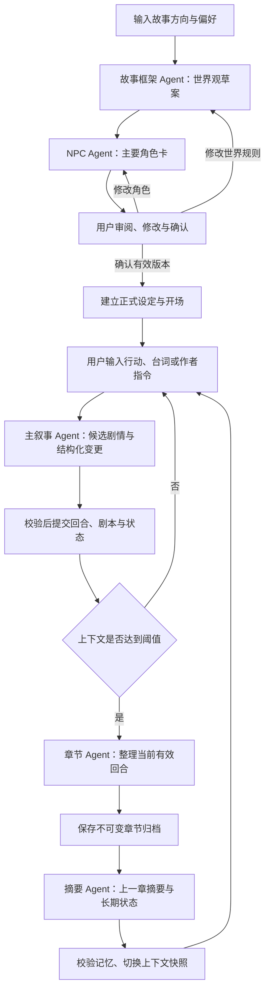

# 漫想 · 写作陪伴助手 PRD

| 项目 | 说明 |
| --- | --- |
| 版本 | v0.1 · 需求评审稿 |
| 核心定位 | 引导用户建立故事设定，通过持续对话共同写作，并将过程沉淀为可导出的结构化剧本 |
| 首版形态 | 单人使用的中文网页写作工作台，适配桌面与手机 |
| 主要角色 | 用户、故事框架 Agent、NPC Agent、主叙事 Agent、章节 Agent、摘要 Agent |
| 范围声明 | 本文定义写作陪伴助手的产品需求；此前《互动故事 PRD》作为另一份需求草案保留 |
| 决策说明 | 用户指定的流程与成功标准为已确定需求；本文补充的数量、阈值和性能目标为首版建议，待评审确认 |

## 1. 产品定位与成功标准

### 1.1 产品概述

用户先描述故事方向与创作偏好。故事框架 Agent 生成世界观草案，NPC Agent 基于草案生成主要角色卡。用户确认或修改后，主叙事 Agent 根据每轮输入继续写作；有效对话持续形成剧本草稿。当上下文达到阈值，章节 Agent 将已发生的内容整理为章节并归档，摘要 Agent 随后更新上一章摘要与长期故事状态，为下一轮写作提供连续、准确的上下文。

用户既可以代入角色采取行动，也可以以作者身份调整创作方向。产品应识别两者的区别，让用户掌握故事的关键决定，并减少整理设定、回顾前情和手工编排剧本的负担。

### 1.2 已确定的成功标准

1. 用户可以创建一个故事，并输入故事方向与偏好。
2. 用户能够查看、修改并确认世界观和主要角色。
3. 用户可以连续输入行动、台词或写作意图，推进剧情。
4. 对话中的正式剧情持续写入结构化剧本，而不是仅保存在聊天界面。
5. 用户可以随时导出结构化剧本，包括尚未归档的有效剧情。
6. 达到上下文阈值时，系统能够完成章节生成、归档和记忆更新。
7. 上下文压缩后，已确认的人物设定、仍有效的关键事实及未解决伏笔不丢失。

### 1.3 用户价值

- **容易开始：**通过引导问题把模糊灵感变成世界观和角色。
- **持续陪伴：**面对用户每轮输入提供有回应、可接续的剧情。
- **创作可控：**设定先确认，关键选择由用户掌握，作者指令不会被误写为故事事件。
- **自动整理：**随写随形成剧本，长对话自动归档为章节。
- **长篇连续：**压缩的是工作上下文，原始记录和正式事实仍可追溯。

## 2. 用户场景与首版范围

### 2.1 典型场景

| 用户场景 | 用户表达 | 产品应提供的帮助 |
| --- | --- | --- |
| 有方向但没有完整设定 | “想写一个温暖的末日旅行故事” | 引导补充基调、主角与冲突，生成可修改的草案 |
| 希望人物更具体 | “搭档不要只是搞笑角色，他应该有自己的秘密” | 更新角色动机与秘密，并提示关联设定变化 |
| 想代入主角行动 | “我把地图交给她，问她愿不愿意同行” | 生成对方反应与后续处境，记录物品与关系变化 |
| 以作者身份调整表达 | “这段少一点旁白，增加两人的对话” | 按写作指令处理，不把指令当成主角台词 |
| 长时间创作后继续 | “继续上次的故事” | 恢复最近完整回合、章节摘要和长期状态 |
| 整理成可用作品 | “导出目前写好的剧本” | 导出章节、场景、动作、对白及未归档草稿 |

### 2.2 P0：首版必须包含

- 故事创建向导与偏好记录。
- 世界观草案、主要角色卡生成及用户确认。
- 确认版本管理和设定变更影响提示。
- 每轮输入、主叙事生成、结构化剧本自动写入。
- 当前场景、角色、关键事实和伏笔的状态管理。
- 自动章节整理、归档、上一章摘要与长期状态更新。
- 上下文预算计算、阈值触发及整理失败恢复。
- 故事保存、重新进入和继续写作。
- Markdown、JSON 两种结构化导出。
- 回合幂等、顺序写入、版本冲突及错误提示。

### 2.3 P1：后续迭代

- 自定义章节边界、章节标题与篇幅目标。
- 已归档章节的深度改写、历史回退与分支创作。
- DOCX / PDF 导出与专业剧本版式。
- 跨设备账号同步、设定导入、全文检索。
- 个性化写作风格、多个备选剧情比较。

### 2.4 首版约束

- 一个故事一条正式时间线，一次只处理一个写作或整理事务。
- 五个 Agent 表示独立职责，不要求五个模型，也不要求并行运行。
- 主要角色默认生成 3～5 张卡片，用户可删减；这是产品默认值，不构成故事人物总数上限。
- 首版默认当前浏览器匿名续写，服务端保存作品；浏览器保存随机访问凭证。用户应知道清除浏览器数据可能失去匿名访问入口。
- 首版不把多人协作、图像生成、复杂战斗数值或社区发布纳入核心闭环。

## 3. 端到端流程

### 3.1 整体流程

导出是全流程可用的操作，不需要等待上下文阈值或章节归档。生成和整理失败均返回可恢复状态，不跳过校验继续推进。

### 3.2 创建与确认

1. 用户填写故事方向；不确定的偏好可选择“由助手建议”。
2. 框架 Agent 生成草案，NPC Agent 基于该草案生成角色卡。
3. 页面同时提供世界观与角色的审阅入口。
4. 用户可直接编辑字段、用自然语言要求修改，或重新生成未确认的内容。
5. 系统标记依赖已发生变化的内容，要求完成复核。
6. 用户点击“确认设定，开始写作”。只有世界观和角色版本全部有效，才能建立正式设定。
7. 主叙事 Agent 生成开场，并进入持续写作页。

### 3.3 每轮共同写作

1. 用户输入内容，并可选择“角色行动 / 台词”或“作者指导”；默认自动识别。
2. 系统检查输入类别、设定版本、故事版本及上下文预算。
3. 需要澄清时先提问，不增加正式剧情回合。
4. 主叙事 Agent 生成正文、场景与对白块、事件及状态变更提案。
5. 校验通过后，原子保存回合、剧本增量和动态状态。
6. 页面显示正式结果及“已写入剧本”。
7. 如果达到整理阈值，先完成章节与记忆整理，再允许下一次正式提交。

### 3.4 自动归档与继续写作

1. 在完整回合提交后检测阈值，锁定待归档回合范围。
2. 章节 Agent 整理该范围内的正式剧情，生成章节草稿。
3. 校验章节覆盖范围、事件顺序、人物与对白；通过后保存章节归档。
4. 摘要 Agent 基于归档来源、正式事件和上一版长期状态生成新记忆快照。
5. 校验关键事实、角色字段和未解决伏笔的保留情况。
6. 快照可用后，切换到“最新上一章摘要 + 长期状态 + 新的活动回合”上下文。
7. 界面提示“第 N 章已归档，可以继续写作”。

达到技术阈值不代表剧情已经结束。若场景尚未收束，可形成“本章第一节”等连续归档单元，保留待续状态，不强行解决冲突或制造结局。

## 4. 引导输入与草案确认需求

### 4.1 故事方向与偏好（FR-01）

| 字段 | 要求 | 示例 |
| --- | --- | --- |
| 故事方向 | 必填，自由描述 | “失去记忆的邮差寻找最后一位收件人” |
| 题材 | 可多选或自填 | 奇幻、悬疑、旅行 |
| 情绪基调 | 可选，允许混合 | 温暖、克制、略带遗憾 |
| 主角设想 | 可选 | 身份、目标、性格与能力限制 |
| 叙述视角 | 可选，有默认值 | 第一人称 / 第三人称 |
| 写作风格 | 可选 | 对白较多、少解释、细节丰富 |
| 参与方式 | 可选 | 主要扮演主角 / 作为作者共同编排 |
| 篇幅与节奏 | 可选 | 短篇、中篇、开放续写；慢节奏 |
| 内容偏好与避开项 | 可选 | 希望有伙伴关系；不希望重要人物死亡 |

规则：

- 必填信息控制在故事方向一个字段，其余通过建议降低开局成本。
- 用户可以检查并修改助手补全的偏好。
- 区分“必须遵守的约束”和“倾向性的偏好”。用户选择的硬约束不得被后续剧情自行改写。
- 偏好调整只默认影响未来写作；重写既有剧情属于另一项明确操作。

### 4.2 世界观草案（FR-02）

框架 Agent 输出：故事名建议、核心命题、时代与环境、世界运行规则、关键地点、社会关系、主要矛盾、主角初始处境、可探索方向，以及待用户决定的问题。

- 将尚未确认的内容标为“草案”。
- 明确世界规则与限制，避免只有氛围描述而无法支持行动判断。
- 用户未指定结局时，不把具体结局锁定为必然结果。
- 世界草案与用户硬约束冲突时，应提示冲突并修复，不能让用户无意中确认互相矛盾的设定。
- 每次修订形成新版本；用户编辑的字段默认保留，局部生成不无声覆盖其他字段。

### 4.3 NPC 主要角色卡（FR-03）

NPC Agent 基于当前世界版本及主角设想输出：

| 字段 | 说明 |
| --- | --- |
| 角色 ID / 名称 | ID 稳定，改名不改变人物身份 |
| 身份与功能 | 在世界中的职业、角色关系与叙事作用 |
| 外貌与显著特征 | 可用于辨识的稳定特征 |
| 性格与行为边界 | 价值观、习惯、不会轻易采取的行为 |
| 动机与目标 | 当下追求与长期愿望 |
| 与主角及其他人的关系 | 关系起点、已知经历 |
| 语言特征 | 口吻、表达习惯、称呼方式 |
| 秘密与知识范围 | 隐藏动机、知道与不知道的事情 |
| 初始动态状态 | 所在位置、持有物、当前处境 |
| 关联版本 | 生成所依据的世界版本 |

主角设定也进入角色集合，但要明确标记用户控制权；NPC Agent 不得代替用户决定主角的重大承诺。

### 4.4 用户确认与依赖检查（FR-04）

- 世界观、主要角色分别保存草案版本与确认状态。
- NPC 生成后，如果世界规则改变，受影响的角色卡标记“需要复核”。
- 系统说明影响，例如“魔法改为不可用，角色 A 的能力设定需要调整”。
- 用户可以接受建议修改，也可以自行调整；未通过一致性检查时不能开始正式写作。
- 同一确认操作绑定明确的世界版本和角色版本集合。
- 生成失败保留最后一个可编辑草案，不回退到空白页。

## 5. Agent 职责与交接合同

### 5.1 职责矩阵

| Agent | 输入 | 输出 | 不得直接决定或修改 |
| --- | --- | --- | --- |
| 故事框架 Agent | 故事方向、偏好、用户修订、现有草案 | 世界观草案与待确认项 | 用户确认状态、已发生的正式事件 |
| NPC Agent | 世界版本、主角设想、关系需求 | 角色卡草案、依赖关系、冲突提示 | 世界基础规则、其他已确认内容 |
| 主叙事 Agent | 正式设定、用户输入、活动回合、记忆、动态状态 | 剧情、剧本块、事件、状态变更提案 | 已归档正文、已确认设定、正式版本号 |
| 章节 Agent | 锁定范围内的正式回合、剧本块与事件 | 章节标题、章节正文、场景结构、来源映射 | 新剧情事实、既有事件结果、尚未作出的选择 |
| 摘要 Agent | 正式事件、已归档来源、上一章与长期状态 | 上一章摘要、长期状态快照、未解伏笔索引 | 正式角色卡、原始对话、归档正文、无依据的新事实 |

所有 Agent 输出先保存为候选结果。系统负责校验、分配版本、权限检查及正式提交；任何 Agent 不可绕过提交流程写入正式故事状态。

### 5.2 通用交接要求

每次任务记录故事 ID、任务 ID、来源版本、覆盖回合范围、输出结构版本和执行状态。

- 下游只使用已通过校验的上游结果。
- 输入版本已过期时，丢弃候选提交或重新计算，不能覆盖新状态。
- 重试沿用任务身份与锁定范围，避免重复归档、重复写入回合。
- 确定性的结构及引用约束由系统检查；叙事质量可由模型辅助检查，但不能代替事实校验。
- 失败定位到具体阶段，恢复时从该阶段继续，不默认重跑整个链路。

## 6. 持续叙事与剧本写入

### 6.1 输入语义（FR-05）

| 输入类别 | 示例 | 是否形成故事事件 |
| --- | --- | --- |
| 角色行动 | “我走到窗边，检查那枚印章” | 由实际结果决定 |
| 角色台词 | “我问她：你还记得那封信吗？” | 正式发生时写入对应说话人的对白 |
| 未来写作指导 | “接下来让节奏慢一点” | 指导本身不是事件，仅影响后续生成 |
| 回顾或询问 | “我们之前答应了什么？” | 不推进时间，不新增剧情事实 |
| 设定修订 | “把她的身份改为医生” | 进入显式设定修改流程 |
| 改写已有正文 | “重写上一段” | 首版提示该能力范围，不直接重算历史状态 |

- 自动识别存在明显歧义时，用简短澄清确认处理方式。
- 写作指导与角色台词混合时分开存储，避免作者命令进入角色对白。
- 用户直接宣称行动必然成功时，仍需符合已经确认的故事规则；作者明确要求修改规则则进入修订流程。
- 主叙事 Agent 不擅自替用户作出重要选择，不一次推进越过多个本应由用户参与的决策点。

### 6.2 回合生成与提交（FR-06）

一次成功的剧情回合包含：用户原始输入、输入类别、正式叙事文本、结构化剧本块、已发生事件、动态状态变更、涉及的事实与伏笔引用，以及可选的后续方向建议。

- 动态状态逐回合更新，不等到摘要 Agent 运行才更新物品、人物位置与关系。
- 主叙事 Agent 给出变更提案；系统校验后，同回合的正文、剧本块、事件和状态一起提交。
- 回顾、澄清和偏好设置保留在对话记录中，但不伪装为正式剧情回合。
- 流式输出在提交前属于候选文本，显示“生成中”；不得提前更新背包、角色或事实面板。
- 提交成功后才显示“已保存 / 已写入剧本”。

### 6.3 对话记录与结构化剧本（FR-07）

系统同时维护两种可追溯内容：

1. **原始对话记录：**保存用户输入、作者指导、澄清、正式回复及对应处理状态。
2. **结构化剧本：**将已提交剧情组织为场景、动作、人物对白与旁白。

建议剧本块字段：`block_id`、`source_turn_id`、`scene_id`、`type`、`speaker_id`、`content`、`order`。其中 `type` 至少包含场景标题、动作、对白、旁白。

规则：

- 用户明确说出的角色台词进入对白块，不在生成文本中重复记录两次。
- 作者指导保留在原始记录中，不直接写成舞台动作或角色台词。
- 每个正式回合都有剧本来源映射，不因归档而丢失。
- 未归档内容作为“当前章节草稿”持续可见和可导出。
- 首版允许只读查看已发生正文。若用户发现事实错误，可提交结构化纠正，保留来源和修订记录；跨历史正文重写放入后续版本。

## 7. 上下文预算、章节生成与归档

### 7.1 上下文组成（FR-08）

每轮生成使用：系统写作规则、正式世界与相关角色、硬约束、上一章摘要、长期故事状态、相关旧事件、当前未归档回合及本次输入。

- 系统持久保存完整历史，模型工作上下文只加载当前所需内容。
- “未装入本轮提示词”不等于“从故事中删除”。
- 角色卡按实体保存在正式设定库；相关角色完整调入，其他角色可按需检索。
- 重要事实与未解决伏笔保存为独立条目，不只存在于自然语言摘要中。

### 7.2 阈值定义

设模型总上下文容量为 `L`，预留最大输出为 `R`，安全余量为 `M`，本轮允许输入预算为 `B = L - R - M`。实际组装输入估算为 `T`，占用率为 `T / B`。

首版建议：

- 正式回合提交后，占用率达到 70% 时触发章节整理。
- 下一轮提交前再次计算预算；达到 85% 时必须先完成整理，不能直接发起主叙事生成。
- 整理期间允许编辑下一轮草稿、回顾历史和导出，暂不提交新的剧情回合。
- 阈值按模型配置管理，不使用固定聊天条数代替 token 预算。
- 若单条输入或必须保留的设定本身已超过预算，提示精简输入或配置容量；不静默截断人物设定和硬约束。
- 整理后的上下文仍超限时，优先减少无关原文、按实体检索旧事件；仍不可用则暂停生成并明确提示。

70% 和 85% 是待评测默认值，不能视为所有模型均适用的固定标准。

### 7.3 章节生成（FR-09）

章节 Agent 只整理锁定范围内已经正式发生的内容：

- 生成章节名、场景分段、动作与对白组织。
- 允许修整衔接和非事实性重复，不改变行动结果、说话人、承诺或事件顺序。
- 不自动填补尚未发生的过渡事件，不为章节完整而解决伏笔。
- 用户明确指定必须保留的台词须保持原文。
- 为章节及各场景保留来源回合范围；原始剧本块仍可读取。
- 已归档范围不得重叠；每个正式回合要么属于一个归档范围，要么属于当前草稿。

### 7.4 归档与记忆切换（FR-10）

归档与记忆更新是可恢复的分阶段过程：

> 待整理 → 章节生成中 → 章节待校验 → 章节已归档、记忆待更新 → 记忆校验中 → 可继续写作。

- 归档正文保存后，不因摘要失败而再次创建同一章节。
- 旧上下文快照在新快照通过校验前仍保留。
- 只有新摘要、长期状态、覆盖范围和连续性锚点全部有效时，才切换上下文快照。
- 切换只改变下轮输入的组织方式，不删除历史或重复应用世界状态变更。
- 页面能区分“章节已保存”与“记忆更新完成”，不提前宣告全部完成。

## 8. 摘要与长期故事状态

### 8.1 上一章摘要（FR-11）

每份摘要必须包含：章节 ID 与来源范围、本章关键事件、人物关系变化、取得或失去的重要物品、新发现的事实、仍未解决的问题，以及章末衔接位置。

章末衔接位置至少说明：谁在场、在哪里、什么时间、刚发生什么、用户下一步面临的决定。

“上一章摘要”指向最近一个完成记忆更新的归档单元；旧摘要按版本保留，不被删除。

### 8.2 长期故事状态（FR-12）

| 类型 | 必须保留的内容 | 更新规则 |
| --- | --- | --- |
| 正式设定引用 | 世界版本、角色卡版本、硬约束 | 用户确认修改后才改变 |
| 角色动态状态 | 位置、身体状况、持有物、目标、关系 | 根据已提交事件更新 |
| 关键事实 | 事实 ID、内容、有效状态、来源、涉及实体 | 新事件可使旧事实失效，但须保留改变依据 |
| 承诺与重要决定 | 谁对谁承诺什么、当前履行状态 | 不因摘要缩短而删除 |
| 未解决伏笔 | 伏笔 ID、首次出现、相关角色、线索、当前状态 | 有明确事件支撑才可推进、解决或废弃 |
| 角色知识 | 谁知道某事实、何时获知 | 防止 NPC 使用不属于其认知的信息 |
| 长期目标与冲突 | 当前目标、阻碍、未完成条件 | 状态变化必须可追溯 |
| 连续性锚点 | 当前时空、在场人物、待执行意图 | 精确衔接归档前后的场景 |

伏笔状态建议为：已埋设、已推进、已解决、明确废弃。未进入“已解决 / 明确废弃”的伏笔都属于未解决集合。

### 8.3 压缩后的不丢失规则

1. 已确认角色卡不由摘要 Agent 重写，只在快照中引用其有效版本。
2. 摘要不是唯一事实来源。关键事实和伏笔使用结构化条目保存。
3. 每个新快照需与旧快照及本阶段新增事件核对：仍有效的关键事实与未解决伏笔必须全部保留。
4. 若某条事实被替代、伏笔被解决或明确废弃，必须提供对应事件引用；“摘要没提到”不是删除理由。
5. 摘要不得把猜测升级成事实，也不能把角色的误解变成世界真相。
6. 场景相关伏笔与事实在后续生成前必须能够按人物、地点或任务被检索到。
7. 连续性检查失败时，不启用新快照，不继续生成下一正式回合。

### 8.4 状态权威顺序与纠错

- 世界规则与人物静态设定以用户确认的版本为准。
- 动态状态以正式事件及其状态快照为准。
- 上一章摘要和自然语言回顾是派生内容，不能覆盖以上两类来源。
- 用户纠正事实时，系统说明影响范围，确认后记录纠正事件并更新相关索引。
- 如果纠正需要大范围改写已归档章节，首版保留原文并提供修订说明，不把无法保证一致性的历史重写悄悄执行。

## 9. 保存、恢复与结构化导出

### 9.1 保存与恢复（FR-13）

- 故事配置、已确认设定、正式回合、剧本、归档、摘要及长期状态均持久保存。
- 故事列表展示标题、最近创作时间、当前章节及处理状态。
- 重开页面后恢复最近完整状态；未完成任务先查询原任务，避免重新推进。
- 同一请求 ID 最多提交一个正式回合；同一归档范围最多创建一份有效归档记录。
- 不同标签页发生版本冲突时，要求加载最新结果，不能按旧状态覆盖。

### 9.2 随时导出（FR-14）

P0 提供两种格式：

| 格式 | 用途 | 内容 |
| --- | --- | --- |
| Markdown | 阅读、继续编辑、复制到其他写作工具 | 故事信息、世界观、角色、章节、场景、动作、对白与当前草稿 |
| JSON | 结构化处理与后续迁移 | 版本、实体 ID、章节与剧本块、来源映射、状态与记忆 |

导出必须基于一个一致的已提交快照，包含：

- 导出时间、故事 ID、格式版本、最后完整回合 ID。
- 当前正式世界观和角色卡的版本。
- 已归档章节及场景、动作、对白、旁白。
- 所有未归档但已提交的剧本块，明确标注“当前章节草稿”。
- 上一章摘要、长期状态、关键事实与未解决伏笔索引。
- 作者指令与原始对话作为单独附录或结构化区段，不混入正式正文。

边界规则：

- 创建期尚未确认时仍可导出，明确标注“设定草案”，不伪造正式章节。
- 正在生成时导出截至最近已提交回合的版本，提示不包含进行中的候选文本。
- 章节已归档但摘要待更新时，可导出章节和正式剧本，并明确标注记忆快照覆盖到哪个回合。
- 导出过程中即使新回合完成，本次导出也保持原快照一致。
- 已归档回合不再作为草稿重复导出；正文与附录的来源关系要明确。
- 首版不宣称 JSON 已支持重新导入；导入是后续能力。

## 10. 页面与交互要求

| 页面 / 区域 | 关键内容与操作 |
| --- | --- |
| 我的故事 | 创建故事、继续写作、最近章节、任务状态 |
| 故事创建向导 | 方向输入、偏好选择、助手补全建议 |
| 设定确认页 | 世界观与角色卡、逐项编辑、冲突标记、确认按钮 |
| 写作工作台 | 连续对话、输入类型、行动输入、保存状态 |
| 剧本面板 | 当前章节草稿、场景结构、对白与动作、对应来源 |
| 设定与记忆面板 | 正式角色卡、世界规则、动态状态、事实与伏笔 |
| 章节列表 | 已归档正文、摘要、回合范围、整理状态 |
| 导出入口 | 格式、当前导出范围、快照状态、下载 |

交互原则：

- 用户主要看到“整理章节”“更新故事记忆”等任务状态，无需理解 Agent 调度。
- 生成失败时保留用户输入和最后一个完整结果。
- 整理期间可继续输入草稿，但提交按钮明确说明等待原因。
- 剧情输出后显示本回合是否已写入剧本，不能只显示模型已输出。
- 用户回看历史时不强行滚动到最新消息。
- 中文输入法组合输入中的回车不得误提交；关键操作可用键盘完成。
- 作者可查看自己作品的设定和秘密；主叙事中的 NPC 仍必须遵守各自知识范围。

## 11. 数据对象与一致性要求

| 对象 | 关键字段 / 关系 |
| --- | --- |
| 故事 | 归属、标题、创作偏好、当前工作状态与版本 |
| 设定版本 | 世界版本、角色版本集合、用户确认记录 |
| 角色 | 稳定 ID、静态卡片、动态状态、知识集合 |
| 写作任务 | 请求 ID、来源版本、任务类别、处理阶段、失败原因 |
| 对话记录 | 原始输入、输入分类、回复、关联回合、确认状态 |
| 正式回合 | 回合 ID、来源设定版本、正文、事件、前后状态版本 |
| 剧本块 | 类型、内容、说话人、场景、顺序、来源回合 |
| 章节归档 | 章节 ID、来源范围、正文、场景与来源映射 |
| 事实 / 伏笔 | 稳定 ID、当前状态、涉及实体、来源与变更证据 |
| 记忆快照 | 上一章摘要、长期状态、覆盖范围、设定引用、可用状态 |
| 导出快照 | 导出范围、格式版本、最后完整回合、记忆覆盖范围 |

必须维持：

- 一个正式回合的正文、剧本块、事件与状态更新一致提交。
- 归档范围不重叠、不跳过有效剧情回合。
- 新记忆快照只能引用已经存在且版本有效的内容。
- 压缩不得重复应用同一事件，例如再次扣除物品或再次增加关系变化。
- 正式历史可追溯；修订作为有依据的变更记录存在。

## 12. 异常与恢复策略

| 异常 | 处理 | 恢复点 |
| --- | --- | --- |
| 世界草案生成失败 | 保留用户输入与旧草案 | 框架生成阶段 |
| 角色与世界版本不匹配 | 标记受影响角色，阻止整体确认 | 角色修订与复核 |
| 输入意图不清 | 请求澄清，不推进剧情 | 当前输入 |
| 主叙事超时 | 查询原任务，保留旧正式状态 | 同一任务结果或明确失败后重试 |
| 正文与状态冲突 | 阻止提交，携带冲突原因修复一次 | 当前候选回合 |
| 剧本写入失败 | 不宣告回合成功 | 原事务重试 |
| 章节生成失败 | 保留活动回合与旧记忆，可导出草稿 | 同一归档范围 |
| 章节已归档、摘要失败 | 不重复生成章节，不切换上下文 | 摘要生成阶段 |
| 摘要遗漏事实或伏笔 | 校验失败，保留旧快照，重新生成 | 记忆校验阶段 |
| 新快照仍超预算 | 减少无关上下文；仍失败则暂停 | 上下文组装阶段 |
| 用户刷新或网络断开 | 恢复任务状态，防止重复提交 | 最后完整阶段 |
| 同一故事并发写入 | 以状态版本拒绝过期提交 | 加载最新结果 |
| 导出失败 | 保留已提交故事，不影响继续写作 | 同一快照重新导出 |

模型调用、章节归档、记忆快照和导出任务使用独立状态，便于识别“内容已保存但整理尚未完成”等情况。

## 13. 非功能要求与指标

### 13.1 性能、成本与可用性

以下为待评测目标：

- 用户提交后 1 秒内显示明确的处理中反馈。
- 普通叙事回合 P95 完成并保存时间目标为 20 秒以内。
- 章节与摘要整理显示当前阶段，不通过虚假百分比表达未知进度。
- 模型上下文、单回合输出、自动修复次数和超时配置可调整。
- 统计叙事、章节、摘要各阶段的耗时与模型用量，避免每轮无必要地重新生成所有设定。
- 服务重启、客户端刷新后能够从已持久化阶段恢复。
- 存档及导出校验访问归属；诊断日志不无必要地保存完整私人故事或凭证。

### 13.2 核心体验指标

| 指标 | 口径 |
| --- | --- |
| 开局完成率 | 确认世界观与角色并完成开场的故事 / 已创建故事 |
| 连续写作完成率 | 完成至少 10 个正式剧情回合的故事 / 已完成开场故事 |
| 剧本写入完整率 | 有完整来源映射的已提交剧情回合 / 全部已提交剧情回合 |
| 归档成功率 | 章节归档与记忆切换全部成功的任务 / 触发的整理任务 |
| 关键记忆保留率 | 压缩后保留或有依据变更的必保留条目 / 压缩前必保留条目 |
| 压缩后引用正确率 | 评测中正确使用相关设定、事实与伏笔的后续回合 / 被评测回合 |
| 导出完整率 | 导出无遗漏、无错误重复、来源可追溯的快照 / 被检查快照 |
| 创作控制感 | 用户对“助手遵守设定、响应意图、没有替我作决定”的评价 |

关键记忆保留率和剧本写入完整率在确定性验收用例中要求 100%；不能用平均值掩盖关键角色设定或唯一伏笔的丢失。生成行为层面的引用正确率需通过固定测试集与人工复核评估。

最小埋点：故事创建、草案生成、设定确认、回合提交、剧本写入、整理触发、章节归档、记忆校验、上下文切换、导出完成和阶段失败。

## 14. 验收标准

| 编号 | 场景 | 通过条件 |
| --- | --- | --- |
| AC-01 | 仅提供故事方向 | 能补充可编辑偏好，完成世界观和角色草案 |
| AC-02 | 用户修改世界规则 | 受影响角色被标记，复核前不能整体确认 |
| AC-03 | 开始正式写作 | 使用用户已确认的世界及角色版本，不能混入旧草案 |
| AC-04 | 连续推进剧情 | 至少完成 10 个正式回合，每轮回应用户输入且产生可续写内容 |
| AC-05 | 角色台词与作者指导混合 | 作者指令不被写成角色台词，正式台词不重复 |
| AC-06 | 查询前情 | 正确回顾已知信息，不改变时间、物品或角色关系 |
| AC-07 | 剧本持续写入 | 每个正式回合都有场景 / 动作 / 对白等剧本块及来源映射 |
| AC-08 | 人物设定冲突 | 主叙事输出违背硬设定时被阻止提交或修复 |
| AC-09 | 达到阈值 | 在完整回合边界触发整理，期间保留输入草稿 |
| AC-10 | 场景尚未结束时整理 | 章节可待续，不虚构新事件或强行结束伏笔 |
| AC-11 | 章节覆盖范围 | 所有来源回合均被覆盖，无重叠归档、无漏回合 |
| AC-12 | 摘要更新 | 新摘要包含关键经过和章末锚点，引用正确来源范围 |
| AC-13 | 角色设定跨压缩 | 正式角色卡与有效版本保持一致，不由摘要改写 |
| AC-14 | 关键事实跨压缩 | 所有仍有效关键事实保留；失效事实有正式事件依据 |
| AC-15 | 未解决伏笔跨压缩 | 未解决集合完整，不能无依据变为已解决或消失 |
| AC-16 | 连续多次压缩 | 固定故事完成至少 30 回合及 3 次强制整理后，人物、事实与伏笔仍符合 AC-13～15 |
| AC-17 | 压缩后继续剧情 | 首个续写回合正确衔接人物、地点、时间与待处理行动 |
| AC-18 | 相关伏笔再次出现 | 后续输入涉及该人物或地点时，系统检索并正确使用历史线索 |
| AC-19 | 摘要失败后恢复 | 不重复归档，不启用未校验快照，从摘要阶段恢复 |
| AC-20 | 正式回合保存失败 | 不显示已写入剧本，不出现正文成功而状态缺失 |
| AC-21 | 重复请求和标签页并发 | 最多一次正式提交，过期版本得到明确冲突提示 |
| AC-22 | 整理期间刷新 | 可恢复到原阶段，已归档章节不会丢失或重复 |
| AC-23 | 随时导出 | 创建期、写作中、整理中均可导出一致快照，并正确标注范围 |
| AC-24 | 导出内容覆盖 | 归档章节和未归档正式草稿均包含，无缺回合、无错误重复 |
| AC-25 | JSON 结构 | 可被标准解析器读取，实体与来源引用有效，格式版本明确 |
| AC-26 | 上下文容量不足 | 不静默丢弃硬约束、角色设定或唯一线索，明确暂停或调整上下文 |
| AC-27 | 事实已变化 | 压缩保留新状态及变化依据，不机械恢复过期状态 |
| AC-28 | 匿名续写与归属 | 同一有效凭证恢复原故事，其他访问者不能读取存档 |

### 14.1 记忆验收示例

建立固定测试故事：

- 角色林澈不会游泳，右手有旧伤。
- 唯一的铜钥匙在第 4 回合交给 NPC 阿宁。
- 林澈曾答应不向守卫透露阿宁的身份。
- 一封没有署名的信是未解决伏笔；两次出现了同一枚蓝色印章。
- 最新场景停在河边，用户尚未决定是否登船。

连续 3 次整理后检查：

1. 角色卡仍保留不会游泳与旧伤；叙事不直接让林澈熟练游泳过河。
2. 铜钥匙持有者仍是阿宁，不重复转移、不回到主角背包。
3. 承诺仍在相关记忆中，NPC 与叙事不能无依据认为承诺已解除。
4. 信件与印章仍以未解决伏笔存在，可检索到出现回合。
5. 续写从河边的待决定状态开始，不擅自写成已登船。
6. 导出能找到相关原始回合与归档章节，来源 ID 一致。

另设变更用例：如果第 20 回合用户明确取回铜钥匙，新快照应保留取回后的状态与事件，不因压缩测试而坚持旧持有者。

## 15. 实施里程碑与待确认项

### 15.1 里程碑

| 阶段 | 交付成果 | 完成门槛 |
| --- | --- | --- |
| M1：开局与确认 | 输入向导、世界草案、角色卡、依赖检查与确认 | 用户可从灵感建立一份正式故事设定 |
| M2：持续写作与剧本 | 主叙事、回合提交、剧本面板、保存与导出 | 连续 10 回合，剧本完整且随时可导出 |
| M3：章节与记忆 | 预算检测、章节归档、摘要、长期状态、恢复 | 30 回合、3 次整理的记忆测试通过 |
| M4：试用与质量检查 | 异常处理、移动端、指标与固定评测集 | 全部 P0 验收通过，已知限制可见 |

### 15.2 待确认项及当前默认

| 待确认项 | 当前默认 |
| --- | --- |
| 用户更偏角色扮演还是作者指导 | 两种输入都支持，默认自动识别并允许显式选择 |
| 偏好的输出形式 | 场景、动作、对白和旁白组成的结构化剧本 |
| 是否需要用户手动确认每轮剧情 | 首版校验后自动提交；设定修改需明确确认 |
| 是否允许自动改写历史正文 | 首版不自动改写；纠正以有来源的修订记录处理 |
| 章节是文学章节还是技术分段 | 优先保留叙事自然边界，阈值触发时允许章节内分节 |
| 是否需要账号与跨设备恢复 | 首版当前浏览器匿名续写，后续扩展账号 |
| 模型、预算和阈值 | 不绑定供应商；以评测确定模型和具体容量 |
| 文件格式是否需要 Word | 首版 Markdown + JSON，DOCX / PDF 后续支持 |

首版评审应优先确认用户控制权、正式事实的权威来源、自动归档的边界，以及“压缩后不丢失”的可执行验收口径。
